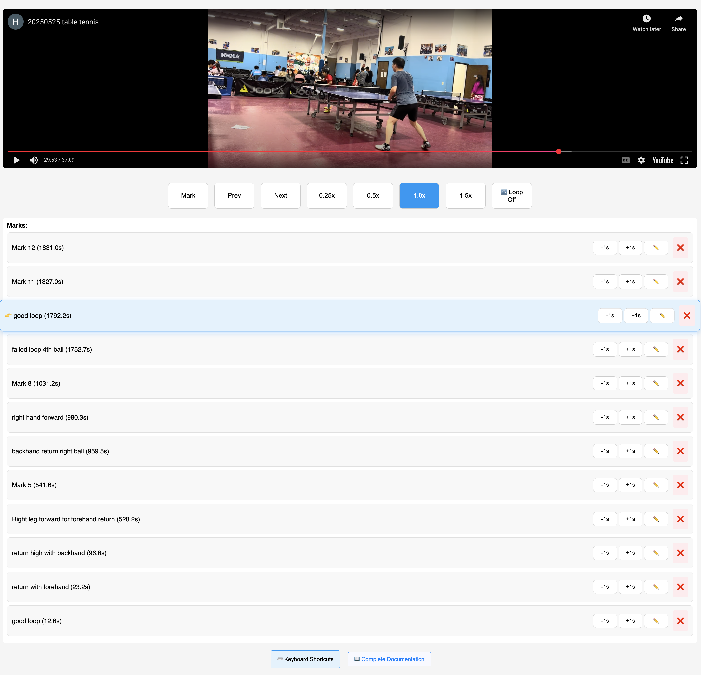

# 🎯 YouTube Video Analyzer

A powerful frame-by-frame video analysis tool perfect for sports coaching, technique improvement, and detailed video study. Originally designed for table tennis game analysis but works great for any sport or educational content.


*Real example: Analyzing table tennis technique with detailed marks for coaching review*

## 🏓 Perfect for Table Tennis Game Analysis

Transform your game improvement process with detailed video analysis and remote coaching collaboration.

### Key Features

- **📍 Precise Timestamping**: Mark important moments with custom names and notes
- **🔄 Loop Mode**: Repeatedly watch critical points to understand technique
- **⚡ Speed Controls**: 0.25x for detailed analysis, 1.5x for quick review
- **🔗 Share URLs**: Collaborate with coaches remotely via compressed share links
- **⏰ Fine Adjustments**: ±1 second timestamp adjustments for perfect timing
- **💾 Auto-Save**: Marks are automatically saved per video
- **📱 Mobile Friendly**: Works on all devices with touch-friendly controls

## 🚀 Quick Start

1. Open https://cydu-cloud.github.io/youtube-video-analyzer/ 
2. Paste a YouTube URL of your match/training video
3. Start marking key moments as you watch
4. Use speed controls and loop mode for detailed analysis
5. Share your analysis with coaches or teammates

## 📋 Table Tennis Analysis Workflow

### 1. Upload & Mark Key Moments
```
• Paste your table tennis match video URL
• Mark important points: winning shots, errors, technique moments
• Use descriptive names like "Great forehand winner" or "Footwork error"
```

### 2. Slow Motion Analysis
```
• Set speed to 0.25x for detailed technique study
• Analyze footwork, paddle angle, ball contact point
• Loop critical rallies to understand the mechanics
```

### 3. Loop Critical Points
```
• Enable loop mode to watch the same rally repeatedly
• Perfect for understanding what went wrong or right
• Study setup, execution, and follow-through
```

### 4. Share with Coach
```
• Generate a share URL with all your marks and notes
• Coach can review remotely and add their observations
• Discuss improvements in your next session
```

## 🎮 Controls Guide

### Video Controls
- **Mark**: Create timestamp at current position (auto-adjusts -0.3s)
- **Prev/Next**: Navigate between your marks
- **Speed**: 0.25x, 0.5x, 1.0x, 1.5x playback speeds
- **Loop**: Toggle looping between current and next mark

### ⌨️ Keyboard Shortcuts
Power users can control everything with keyboard shortcuts:

**Video Control:**
- `Space` - Play/Pause video
- `M` - Mark timestamp at current position
- `L` - Toggle loop mode on/off

**Navigation:**
- `←` (Left Arrow) - Jump to previous mark
- `→` (Right Arrow) - Jump to next mark

**Speed Control:**
- `1` - Set speed to 0.25x (slow motion analysis)
- `2` - Set speed to 0.5x
- `3` - Set speed to 1.0x (normal speed)
- `4` - Set speed to 1.5x (fast review)

*💡 Keyboard shortcuts work when not typing in input fields*

### Mark Management
- **Click timestamp**: Jump directly to that moment
- **±1s buttons**: Fine-tune mark timing (automatically jumps to new position)
- **✏️ Rename**: Add detailed coaching notes
- **❌ Delete**: Remove unwanted marks

### Sharing
- **Share URL**: Generate compressed link with all marks
- **Auto-save**: Marks saved locally per video
- **Cross-device**: Share links work on any device

## 🏆 Pro Tips for Table Tennis Analysis

### Marking Strategy
```
• Mark 2 seconds BEFORE the key moment to see setup
• Use descriptive names: "Perfect topspin technique" vs "Good shot"
• Mark both successes and errors for balanced analysis
• Include tactical notes: "Opponent weak on backhand side"
```

### Speed Usage
```
• 0.25x: Detailed technique analysis (grip, stance, contact)
• 0.5x: Footwork and positioning study
• 1.0x: Normal game flow understanding
• 1.5x: Quick review of multiple points
```

### Loop Mode Best Practices
```
• Use for complex rallies you want to understand deeply
• Perfect for studying opponent patterns
• Great for technique comparison (your shot vs pro player)
• Helps identify recurring mistakes
```

### Coaching Collaboration
```
• Player marks initial observations
• Coach reviews and adds technical feedback
• Discuss via shared URL before next lesson
• Track improvement over multiple sessions
```

## 🌐 Hosting Options

This is a single HTML file that can be hosted anywhere:

- **GitHub Pages**: Free, easy setup with version control
- **Netlify**: Drag-and-drop deployment with custom domains
- **Vercel**: Developer-friendly with automatic deployments
- **Local**: Just open `index.html` in any modern browser

## 🔧 Technical Features

- **YouTube API Integration**: Seamless video loading and control
- **Local Storage**: Automatic mark persistence per video
- **URL Compression**: Efficient sharing with base64 encoding
- **Responsive Design**: Works on desktop, tablet, and mobile
- **No Backend Required**: Pure client-side application

## 📱 Mobile Optimization

- Touch-friendly button sizes (44px minimum)
- Responsive layout for all screen sizes
- Optimized controls for thumb navigation
- Works great on phones and tablets

## 🤝 Use Cases Beyond Table Tennis

- **Tennis**: Serve technique, shot analysis
- **Golf**: Swing mechanics, putting form
- **Basketball**: Shooting form, defensive positioning
- **Education**: Lecture analysis, presentation review
- **Music**: Performance study, technique improvement
- **Dance**: Choreography learning, form correction

## 📄 License

This project is licensed under the MIT License - see the [LICENSE](LICENSE) file for details.

**What this means:**
- ✅ **Free to use** - Personal and commercial use allowed
- ✅ **Modify freely** - Adapt for your sport or needs  
- ✅ **Share and distribute** - Help others improve their game
- ✅ **No warranty** - Use at your own risk
- 📝 **Attribution required** - Keep the license notice when sharing

Perfect for coaches, sports organizations, and developers who want to build upon this tool!

---

**Start analyzing your game today!** 🏓✨

*Perfect your technique, share with coaches, and take your table tennis to the next level.* 